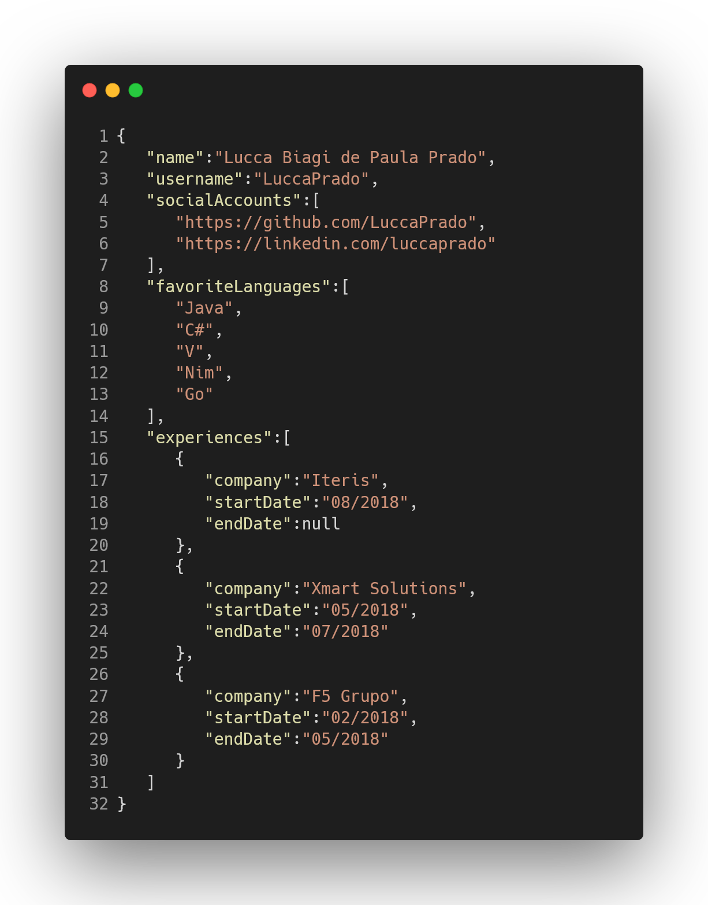

## GET /api/user/info?username=LuccaPrado
### Response: 200 OK

 
  

  <!--"https://carbon.now.sh/?bg=rgba%28208%2C208%2C208%2C0%29&t=vscode&wt=none&l=application%2Fjson&ds=true&dsyoff=20px&dsblur=68px&wc=true&wa=false&pv=56px&ph=56px&ln=true&fl=1&fm=Hack&fs=14px&lh=133%25&si=false&es=2x&wm=false&code=%257B%250A%2520%2520%2520%2522name%2522%253A%2522Lucca%2520Biagi%2520de%2520Paula%2520Prado%2522%252C%250A%2520%2520%2520%2522username%2522%253A%2522LuccaPrado%2522%252C%250A%2520%2520%2520%2522socialAccounts%2522%253A%255B%250A%2520%2520%2520%2520%2520%2520%2522https%253A%252F%252Fgithub.com%252FLuccaPrado%2522%252C%250A%2520%2520%2520%2520%2520%2520%2522https%253A%252F%252Flinkedin.com%252Fluccaprado%2522%250A%2520%2520%2520%255D%252C%250A%2520%2520%2520%2522favoriteLanguages%2522%253A%255B%250A%2520%2520%2520%2520%2520%2520%2522Java%2522%252C%250A%2520%2520%2520%2520%2520%2520%2522C%2523%2522%252C%250A%2520%2520%2520%2520%2520%2520%2522V%2522%252C%250A%2520%2520%2520%2520%2520%2520%2522Nim%2522%252C%250A%2520%2520%2520%2520%2520%2520%2522Go%2522%250A%2520%2520%2520%255D%252C%250A%2520%2520%2520%2522experiences%2522%253A%255B%250A%2520%2520%2520%2520%2520%2520%257B%250A%2520%2520%2520%2520%2520%2520%2520%2520%2520%2522company%2522%253A%2522Iteris%2522%252C%250A%2520%2520%2520%2520%2520%2520%2520%2520%2520%2522startDate%2522%253A%252208%252F2018%2522%252C%250A%2520%2520%2520%2520%2520%2520%2520%2520%2520%2522endDate%2522%253Anull%250A%2520%2520%2520%2520%2520%2520%257D%252C%250A%2520%2520%2520%2520%2520%2520%257B%250A%2520%2520%2520%2520%2520%2520%2520%2520%2520%2522company%2522%253A%2522Xmart%2520Solutions%2522%252C%250A%2520%2520%2520%2520%2520%2520%2520%2520%2520%2522startDate%2522%253A%252205%252F2018%2522%252C%250A%2520%2520%2520%2520%2520%2520%2520%2520%2520%2522endDate%2522%253A%252207%252F2018%2522%250A%2520%2520%2520%2520%2520%2520%257D%252C%250A%2520%2520%2520%2520%2520%2520%257B%250A%2520%2520%2520%2520%2520%2520%2520%2520%2520%2522company%2522%253A%2522F5%2520Grupo%2522%252C%250A%2520%2520%2520%2520%2520%2520%2520%2520%2520%2522startDate%2522%253A%252202%252F2018%2522%252C%250A%2520%2520%2520%2520%2520%2520%2520%2520%2520%2522endDate%2522%253A%252205%252F2018%2522%250A%2520%2520%2520%2520%2520%2520%257D%250A%2520%2520%2520%255D%250A%257D"

GENERATED BY THIS LINK -->
  

<!--
**LuccaPrado/LuccaPrado** is a ✨ _special_ ✨ repository because its `README.md` (this file) appears on your GitHub profile.

Here are some ideas to get you started:

- 🔭 I’m currently working on ...
- 🌱 I’m currently learning ...
- 👯 I’m looking to collaborate on ...
- 🤔 I’m looking for help with ...
- 💬 Ask me about ...
- 📫 How to reach me: ...
- 😄 Pronouns: ...
- ⚡ Fun fact: ...

  <a href="https://github.com/LuccaPrado">
  
 

  

 
   
 
  <!--  

-->
